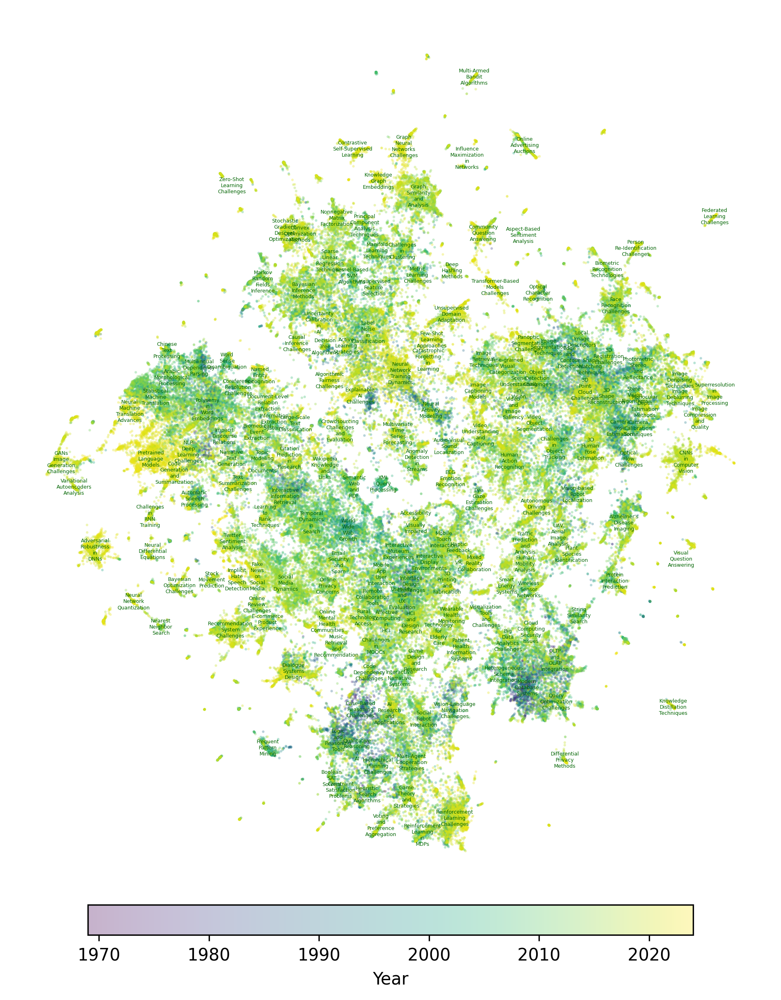

<p align="center">
  <i>Figure: A visualization of key ideas' evolution through time. Darker points indicate more recent work.</i>
</p>

<p align="center">
<a href="https://arxiv.org/abs/2406.06357">
    
</a>
<a href="http://creativecommons.org/publicdomain/zero/1.0/">
    
</a>
<a href="https://github.com/xingjian-zhang/massw/actions/workflows/pycodestyle.yml">
    
</a>
<a href="https://github.com/xingjian-zhang/massw/actions/workflows/pydocstyle.yml">
    
</a>
<a href="https://github.com/xingjian-zhang/massw/actions/workflows/pylint.yml">
    
</a>
</p>

<!-- > This codebase contains the reproduction code for the paper "MASSW: A New Dataset and Benchmark Tasks for AI-Assisted Scientific Workflows". -->

MASSW is a comprehensive text dataset on **M**ulti-**A**spect **S**ummarization of **S**cientific **W**orkflows.
MASSW includes more than 152,000 peer-reviewed publications from 17 leading
computer science conferences spanning the past 50 years.

## Key features

- **Structured scientific workflows**. MASSW defines [five core aspects of a scientific workflow](#core-aspects-of-a-scientific-workflow) -- *context*, *key idea*, *method*, *outcome*, and *projected impact*. These aspects align with the typical stages in scientific workflows identified in recent literature. Utilizing LLMs, we systematically extract and structure these five aspects from each publication.
- **Large scale**. MASSW contains the structured scientific workflows and meta-information from over 152,000 peer-reviewed publications, across 17 leading computer science conferences, and spanning the past 50 years.
- **Accuracy**. The coverage and accuracy of MASSW have been validated through comprehensive inspections and comparisons with human annotations and alternative methods.
- **Rich benchmark tasks**. MASSW facilitates multiple novel and benchmarkable machine learning tasks, such as idea generation and outcome prediction. It supports diverse tasks centered on predicting, recommending, and expanding key elements of a scientific workflow, serving as a benchmark for evaluating LLM agents' ability to navigate scientific research.

## Core aspects of a scientific workflow

| Aspect        | Definition | Example |
|---------------|------------|---------|
| **Context** <br> *Ask questions, review literature (prior to study)* | The status quo of related literature or reality which motivated this study. This could normally be a problem, a research question, or a research gap that has not been successfully addressed by previous work. | *Making language models bigger does not inherently make them better at following a user's intent, as large models can generate outputs that are untruthful, toxic, or not helpful.* |
| **Key Idea** <br> *Construct hypothesis (proposed in this study)* | The main intellectual merit of this paper, often in comparison to the context. This could normally be a novel idea or solution proposed in this paper that distinguishes it from what’s already done in literature. | *The authors propose InstructGPT, a method to align language models with user intent by fine-tuning GPT-3 using a combination of supervised learning with labeler demonstrations and reinforcement learning from human feedback.* |
| **Method** <br> *Test hypothesis (after hypothesis construction)* | The specific research method that investigates and validates the key idea. This could be an experimental setup, a theoretical framework, or other necessary validation methodology to implement and/or evaluate the key idea. | *The authors evaluate the performance of InstructGPT by humans on a given prompt distribution and compare it with a much larger model GPT-3.* |
| **Outcome** <br> *Interpret results, draw conclusion (after testing hypothesis)* | The factual statement about the study output. This could be the experiment results and any other measurable outcome that has occurred. It marks whether the key hypothesis is testified or not. | *InstructGPT, even with 100x fewer parameters, is preferred over GPT-3 in human evaluations. It shows improvements in truthfulness and reductions in toxic outputs with minimal performance regressions on public NLP datasets.* |
| **Projected Impact** <br> *Future work (anticipated but not yet done)* | The author-anticipated impact of the work on the field, and potential further research identified by the author that may improve or extend this study. | *Fine-tuning with human feedback is a promising direction for aligning language models with human intent.* |

## Coverage

MASSW covers 17 leading computer science conferences, including:

- Artificial Intelligence: AAAI, IJCAI;
- Computer Vision: CVPR, ECCV, ICCV;
- Machine Learning: ICLR, ICML, NeurIPS, KDD;
- Natural Language Processing: ACL, EMNLP, NAACL;
- The Web & Information Retrieval: SIGIR, WWW;
- Databases: SIGMOD, VLDB;
- Interdisciplinary Areas: CHI.

## Installation

```bash
pip install -r requirements.txt
pip install -e .
```

## Basic Usage

Search for a specific publication by title:

```python
from massw.data import load_massw

massw = load_massw()
massw.search("attention is all you need")
```

Output:

```python
[Workflow(id='618cfba991e011333c932618', title='Cross-Attention is All You Need - Adapting Pretrained Transformers for Machine Translation.', abstract='We study the power of cross-attention in the Transformer architecture within the context of transfer learning for machine translation, and extend the findings of studies into cross-attention when training from scratch. We conduct a series of experiments through fine-tuning a translation model on data where either the source or target language has changed. These experiments reveal that fine-tuning only the cross-attention parameters is nearly as effective as fine-tuning all parameters (i.e., the entire translation model). We provide insights into why this is the case and observe that limiting fine-tuning in this manner yields cross-lingually aligned embeddings. The implications of this finding for researchers and practitioners include a mitigation of catastrophic forgetting, the potential for zero-shot translation, and the ability to extend machine translation models to several new language pairs with reduced parameter storage overhead.', year=2021.0, venue='EMNLP', context='Cross-attention mechanism in the Transformer architecture has been of interest in the context of transfer learning for machine translation, and there exists previous studies of cross-attention when training from scratch.', key_idea='The authors explore the efficiency of fine-tuning only the cross-attention parameters in a translation model where either the source or target language has changed, as compared to fine-tuning all parameters (the entire translation model).', method='A series of experiments were conducted through fine-tuning a translation model on data where either the source or target language has changed.', outcome='The results revealed that fine-tuning only the cross-attention parameters is nearly as effective as fine-tuning all parameters. The process leads to cross-lingually aligned embeddings.', projected_impact='The findings can mitigate catastrophic forgetting, facilitate zero-shot translation, and allow extension of machine translation models to several new language pairs with reduced parameter storage overhead.', data={'id': '618cfba991e011333c932618', 'title': 'Cross-Attention is All You Need - Adapting Pretrained Transformers for Machine Translation.', 'abstract': 'We study the power of cross-attention in the Transformer architecture within the context of transfer learning for machine translation, and extend the findings of studies into cross-attention when training from scratch. We conduct a series of experiments through fine-tuning a translation model on data where either the source or target language has changed. These experiments reveal that fine-tuning only the cross-attention parameters is nearly as effective as fine-tuning all parameters (i.e., the entire translation model). We provide insights into why this is the case and observe that limiting fine-tuning in this manner yields cross-lingually aligned embeddings. The implications of this finding for researchers and practitioners include a mitigation of catastrophic forgetting, the potential for zero-shot translation, and the ability to extend machine translation models to several new language pairs with reduced parameter storage overhead.', 'keywords': [], 'year': 2021, 'authors': [{'id': '64c1ec89688ef0ffd383e8b3', 'name': 'Mozhdeh Gheini', 'org': 'Univ Southern Calif, Informat Sci Inst, Los Angeles, CA 90007 USA', 'org_id': ''}, {'id': '5631ff8c45cedb3399f8b414', 'name': 'Xiang Ren', 'org': 'Univ Southern Calif, Informat Sci Inst, Los Angeles, CA 90007 USA', 'org_id': ''}, {'id': '5616d61c45ce1e5963b0b70e', 'name': 'Jonathan May', 'org': 'Univ Southern Calif, Informat Sci Inst, Los Angeles, CA 90007 USA', 'org_id': ''}], 'references': ['59ae3c152bbe271c4c71e900', '5e296ede3a55ac6ad1e44fd9', '5de240bd3a55ace1893738ef'], 'doi': '', 'venue_id': '5eba7087edb6e7d53c1009a5', 'n_citation': 38, 'venue': 'EMNLP', 'normalized_venue_name': 'EMNLP'}),
 Workflow(id='5e5e190393d709897ce45fda', title='Channel Attention Is All You Need for Video Frame Interpolation', abstract='Prevailing video frame interpolation techniques rely heavily on optical flow estimation and require additional model complexity and computational cost; it is also susceptible to error propagation in challenging scenarios with large motion and heavy occlusion. To alleviate the limitation, we propose a simple but effective deep neural network for video frame interpolation, which is end-to-end trainable and is free from a motion estimation network component. Our algorithm employs a special feature reshaping operation, referred to as PixelShuffle, with a channel attention, which replaces the optical flow computation module. The main idea behind the design is to distribute the information in a feature map into multiple channels and extract motion information by attending the channels for pixel-level frame synthesis. The model given by this principle turns out to be effective in the presence of challenging motion and occlusion. We construct a comprehensive evaluation benchmark and demonstrate that the proposed approach achieves outstanding performance compared to the existing models with a component for optical flow computation.', year=2020.0, venue='AAAI', context='Existing video frame interpolation techniques heavily rely on optical flow estimation, which increases model complexity and computational cost and is prone to error propagation in scenarios with large motion and heavy occlusion.', key_idea='The authors propose an end-to-end trainable deep neural network for video frame interpolation that does not require a motion estimation network component. They introduce a feature reshaping operation known as PixelShuffle, combined with channel attention, which replaces the optical flow computation module.', method='The authors assess their new model in conditions with challenging motion and occlusion.', outcome='The newly proposed model demonstrates outstanding performance in comparison with existing models that use an optical flow computation component.', projected_impact=None, data={'id': '5e5e190393d709897ce45fda', 'title': 'Channel Attention Is All You Need for Video Frame Interpolation', 'abstract': 'Prevailing video frame interpolation techniques rely heavily on optical flow estimation and require additional model complexity and computational cost; it is also susceptible to error propagation in challenging scenarios with large motion and heavy occlusion. To alleviate the limitation, we propose a simple but effective deep neural network for video frame interpolation, which is end-to-end trainable and is free from a motion estimation network component. Our algorithm employs a special feature reshaping operation, referred to as PixelShuffle, with a channel attention, which replaces the optical flow computation module. The main idea behind the design is to distribute the information in a feature map into multiple channels and extract motion information by attending the channels for pixel-level frame synthesis. The model given by this principle turns out to be effective in the presence of challenging motion and occlusion. We construct a comprehensive evaluation benchmark and demonstrate that the proposed approach achieves outstanding performance compared to the existing models with a component for optical flow computation.', 'keywords': [], 'year': 2020, 'authors': [{'id': '635100b2ac95af67f73c20e3', 'name': 'Myungsub Choi', 'org': '(Seoul National University)', 'org_id': '62331e330a6eb147dca8a707'}, {'id': '645320c8ca4e0609eedd4813', 'name': 'Heewon Kim', 'org': '(Seoul National University)', 'org_id': '62331e330a6eb147dca8a707'}, {'id': '53f43026dabfaee2a1c9f879', 'name': 'Bohyung Han', 'org': '(Seoul National University)', 'org_id': '62331e330a6eb147dca8a707'}, {'id': '53f7c3f6dabfae938c6d9624', 'name': 'Ning Xu', 'org': 'Amazon Go, Seattle, WA USA', 'org_id': ''}, {'id': '53fd9092dabfae8faa5a9792', 'name': 'Kyoung Mu Lee', 'org': '(Seoul National University)', 'org_id': '62331e330a6eb147dca8a707'}], 'references': [], 'doi': '', 'venue_id': '5eba67f5edb6e7d53c100585', 'n_citation': 221, 'venue': 'AAAI', 'normalized_venue_name': 'AAAI'}),
 Workflow(id='5dbc024a3a55ac76d0e3516c', title='Attention Is All You Need for Chinese Word Segmentation', abstract='Taking greedy decoding algorithm as it should be, this work focuses on further strengthening the model itself for Chinese word segmentation (CWS), which results in an even more fast and more accurate CWS model. Our model consists of an attention only stacked encoder and a light enough decoder for the greedy segmentation plus two highway connections for smoother training, in which the encoder is composed of a newly proposed Transformer variant, Gaussian-masked Directional (GD) Transformer, and a biaffine attention scorer. With the effective encoder design, our model only needs to take unigram features for scoring. Our model is evaluated on SIGHAN Bakeoff benchmark datasets. The experimental results show that with the highest segmentation speed, the proposed model achieves new state-of-the-art or comparable performance against strong baselines in terms of strict closed test setting.', year=2020.0, venue='EMNLP', context='Current Chinese word segmentation (CWS) models, which typically employ a greedy decoding algorithm, could be improved in terms of speed and accuracy.', key_idea='This study proposes an attention-only model for CWS, encompassing an attention only stacked encoder, a light decoder, two highway connections for smoother training, and a Transformer variant called Gaussian-masked Directional (GD) Transformer. The encoder uses unigram features for scoring.', method='The proposed model is evaluated using the SIGHAN Bakeoff benchmark datasets.', outcome='The proposed model achieves new state-of-the-art or comparable performance against strong baselines in terms of strict closed test setting, whilst maintaining the highest segmentation speed.', projected_impact=None, data={'id': '5dbc024a3a55ac76d0e3516c', 'title': 'Attention Is All You Need for Chinese Word Segmentation', 'abstract': 'Taking greedy decoding algorithm as it should be, this work focuses on further strengthening the model itself for Chinese word segmentation (CWS), which results in an even more fast and more accurate CWS model. Our model consists of an attention only stacked encoder and a light enough decoder for the greedy segmentation plus two highway connections for smoother training, in which the encoder is composed of a newly proposed Transformer variant, Gaussian-masked Directional (GD) Transformer, and a biaffine attention scorer. With the effective encoder design, our model only needs to take unigram features for scoring. Our model is evaluated on SIGHAN Bakeoff benchmark datasets. The experimental results show that with the highest segmentation speed, the proposed model achieves new state-of-the-art or comparable performance against strong baselines in terms of strict closed test setting.', 'keywords': [], 'year': 2020, 'authors': [{'id': '542e1ff4dabfae48d12468b4', 'name': 'Duan Sufeng', 'org': 'Shanghai Jiao Tong University', 'org_id': '5f71b54b1c455f439fe502b0'}, {'id': '56cb1892c35f4f3c65651db6', 'name': 'Zhao Hai', 'org': 'Shanghai Jiao Tong University', 'org_id': '5f71b54b1c455f439fe502b0'}], 'references': ['53e9acc4b7602d97036a1037', '5c5ce50d17c44a400fc390b8', '53e9b93eb7602d9704528a0e', '53e9b3bcb7602d9703ea4029', '5736974d6e3b12023e63899e', '5cede103da562983788e2880', '5aed14d617c44a4438159341', '5b1642388fbcbf6e5a9b578c', '57a4e91dac44365e35c981c6', '58d82fcbd649053542fd5fde', '5ce2d0bcced107d4c63afa41', '599c7987601a182cd2648373', '53e9bb02b7602d970473d988', '53e9b74ab7602d97042e6482', '5550415745ce0a409eb3a739', '573698636e3b12023e72937b', '59ae3c262bbe271c4c71ef86', '5550446445ce0a409eb4d42e', '53e99cc9b7602d970257bebe', '53e99960b7602d970219efd5', '5a260c2817c44a4ba8a23741', '5a260c8617c44a4ba8a3278b', '53e99a5cb7602d97022c46f3', '53e9a981b7602d97032d97fb', '599c7988601a182cd2648ecb', '5bdc315017c44a1f58a05d1e', '599c795f601a182cd2635762', '53e9b607b7602d970415d4ba', '599c7972601a182cd263e9a2'], 'doi': '10.18653/V1/2020.EMNLP-MAIN.317', 'venue_id': '5eba7087edb6e7d53c1009a5', 'n_citation': 20, 'venue': 'Conference on Empirical Methods in Natural Language Processing', 'normalized_venue_name': 'EMNLP'}),
 Workflow(id='15a601e1-fd02-492c-8864-ee8e1f14fd55', title='Attention is All You Need', abstract='The dominant sequence transduction models are based on complex recurrent orconvolutional neural networks in an encoder and decoder configuration. The best performing such models also connect the encoder and decoder through an attentionm echanisms. We propose a novel, simple network architecture based solely onan attention mechanism, dispensing with recurrence and convolutions entirely.Experiments on two machine translation tasks show these models to be superiorin quality while being more parallelizable and requiring significantly less timeto train. Our single model with 165 million parameters, achieves 27.5 BLEU onEnglish-to-German translation, improving over the existing best ensemble result by over 1 BLEU. On English-to-French translation, we outperform the previoussingle state-of-the-art with model by 0.7 BLEU, achieving a BLEU score of 41.1.', year=2017.0, venue='NeurIPS', context='Prior to this work, sequence transduction models were dominated by complex recurrent and convolutional neural networks in an encoder-decoder configuration, with optimal results found through the use of attention mechanisms connecting the encoder and decoder.', key_idea='The paper introduces a new network architecture, the Transformer, that exclusively relies on an attention mechanism, foregoing recurrence and convolutions entirely.', method='Experiments were conducted on two machine translation tasks to validate the proposed network architecture, comparing its quality, parallelism, and training speed against the existing models.', outcome='The Transformer model outperformed existing models in terms of quality and training efficiency, achieving a BLEU score of 27.5 on English to German translation, which improved over the current best ensemble result by over 1 BLEU, and a BLEU score of 41.1 on English to French translation, surpassing the previous single state-of-the-art model by 0.7 BLEU.', projected_impact=None, data={'id': '15a601e1-fd02-492c-8864-ee8e1f14fd55', 'area': 'ml', 'venue': 'neurips', 'title': 'Attention is All You Need', 'year': 2017, 'data': {'id': 2963403868, 'title': 'Attention is All You Need', 'authors': [{'name': 'Ashish Vaswani', 'id': 2171687631, 'org_id': 1291425158}, {'name': 'Noam Shazeer', 'id': 2496873187, 'org_id': 1291425158}, {'name': 'Niki Parmar', 'id': 2625834147, 'org_id': 1174212}, {'name': 'Jakob Uszkoreit', 'id': 2226984371, 'org_id': 1291425158}, {'name': 'Llion Jones', 'id': 2624808693, 'org_id': 1291425158}, {'name': 'Aidan N. Gomez', 'id': 2626656444}, {'name': 'Lukasz Kaiser', 'id': 2948063405, 'org_id': 1291425158}, {'name': 'Illia Polosukhin', 'id': 2519781307, 'org_id': 1291425158}], 'venue': {'name': 'neural information processing systems', 'id': 1127325140}, 'year': 2017, 'n_citation': 4375, 'page_start': '5998', 'page_end': '6008', 'doc_type': 'Conference', 'publisher': 'Curran Associates Inc.', 'volume': '', 'issue': '', 'indexed_abstract': '{"IndexLength":116,"InvertedIndex":{"The":[0,19],"dominant":[1],"sequence":[2],"transduction":[3],"models":[4,23,59],"are":[5],"based":[6,41],"on":[7,52],"complex":[8],"recurrent":[9],"orconvolutional":[10],"neural":[11],"networks":[12],"in":[13],"an":[14,31],"encoder":[15,27],"and":[16,28,49,68],"decoder":[17,29],"configuration.":[18],"best":[20,90],"performing":[21],"such":[22],"also":[24],"connect":[25],"the":[26,88,102],"through":[30],"attentionm":[32],"echanisms.":[33],"We":[34],"propose":[35],"a":[36,111],"novel,":[37],"simple":[38],"network":[39],"architecture":[40],"solely":[42],"onan":[43],"attention":[44],"mechanism,":[45],"dispensing":[46],"with":[47,77,105],"recurrence":[48],"convolutions":[50],"entirely.Experiments":[51],"two":[53],"machine":[54],"translation":[55],"tasks":[56],"show":[57],"these":[58],"to":[60],"be":[61],"superiorin":[62],"quality":[63],"while":[64],"being":[65],"more":[66],"parallelizable":[67],"requiring":[69],"significantly":[70],"less":[71],"timeto":[72],"train.":[73],"Our":[74],"single":[75],"model":[76,106],"165":[78],"million":[79],"parameters,":[80],"achieves":[81],"27.5":[82],"BLEU":[83,112],"onEnglish-to-German":[84],"translation,":[85,99],"improving":[86],"over":[87,94],"existing":[89],"ensemble":[91],"result":[92],"by":[93,107],"1":[95],"BLEU.":[96],"On":[97],"English-to-French":[98],"we":[100],"outperform":[101],"previoussingle":[103],"state-of-the-art":[104],"0.7":[108],"BLEU,":[109],"achieving":[110],"score":[113],"of":[114],"41.1.":[115]}}', 'fos': [{'name': 'artificial neural network', 'w': 0.47565}, {'name': 'bleu', 'w': 0.50846}, {'name': 'parallelizable manifold', 'w': 0.42665}, {'name': 'convolution', 'w': 0.41377}, {'name': 'encoder', 'w': 0.51848}, {'name': 'computer science', 'w': 0.43723}, {'name': 'network architecture', 'w': 0.45739}, {'name': 'artificial intelligence', 'w': 0.0}, {'name': 'machine learning', 'w': 0.45043}, {'name': 'machine translation', 'w': 0.57648}, {'name': 'single model', 'w': 0.0}], 'url': ['https://arxiv.org/abs/1706.03762', 'https://papers.nips.cc/paper/7181-attention-is-all-you-need.pdf', 'http://papers.nips.cc/paper/7181-attention-is-all-you-need', 'https://arxiv.org/pdf/1706.03762', 'https://ui.adsabs.harvard.edu/abs/2017arXiv170603762V/abstract', 'https://dblp.uni-trier.de/db/conf/nips/nips2017.html#VaswaniSPUJGKP17', 'https://www.arxiv-vanity.com/papers/1706.03762/', 'https://ai.google/research/pubs/pub46201', 'https://research.google/pubs/pub46201/', 'https://dl.acm.org/citation.cfm?id=3295349', 'https://research.google.com/pubs/pub46201.html']}, 'abstract': 'The dominant sequence transduction models are based on complex recurrent orconvolutional neural networks in an encoder and decoder configuration. The best performing such models also connect the encoder and decoder through an attentionm echanisms. We propose a novel, simple network architecture based solely onan attention mechanism, dispensing with recurrence and convolutions entirely.Experiments on two machine translation tasks show these models to be superiorin quality while being more parallelizable and requiring significantly less timeto train. Our single model with 165 million parameters, achieves 27.5 BLEU onEnglish-to-German translation, improving over the existing best ensemble result by over 1 BLEU. On English-to-French translation, we outperform the previoussingle state-of-the-art with model by 0.7 BLEU, achieving a BLEU score of 41.1.'})]
```

Search by unique ID and show all fields:

```python
vars(massw["15a601e1-fd02-492c-8864-ee8e1f14fd55"])
```

Output:

```python
{'id': '15a601e1-fd02-492c-8864-ee8e1f14fd55',
 'title': 'Attention is All You Need',
 'abstract': 'The dominant sequence transduction models are based on complex recurrent orconvolutional neural networks in an encoder and decoder configuration. The best performing such models also connect the encoder and decoder through an attentionm echanisms. We propose a novel, simple network architecture based solely onan attention mechanism, dispensing with recurrence and convolutions entirely.Experiments on two machine translation tasks show these models to be superiorin quality while being more parallelizable and requiring significantly less timeto train. Our single model with 165 million parameters, achieves 27.5 BLEU onEnglish-to-German translation, improving over the existing best ensemble result by over 1 BLEU. On English-to-French translation, we outperform the previoussingle state-of-the-art with model by 0.7 BLEU, achieving a BLEU score of 41.1.',
 'year': 2017,
 'venue': 'NeurIPS',
 'context': 'Prior to this work, sequence transduction models were dominated by complex recurrent and convolutional neural networks in an encoder-decoder configuration, with optimal results found through the use of attention mechanisms connecting the encoder and decoder.',
 'key_idea': 'The paper introduces a new network architecture, the Transformer, that exclusively relies on an attention mechanism, foregoing recurrence and convolutions entirely.',
 'method': 'Experiments were conducted on two machine translation tasks to validate the proposed network architecture, comparing its quality, parallelism, and training speed against the existing models.',
 'outcome': 'The Transformer model outperformed existing models in terms of quality and training efficiency, achieving a BLEU score of 27.5 on English to German translation, which improved over the current best ensemble result by over 1 BLEU, and a BLEU score of 41.1 on English to French translation, surpassing the previous single state-of-the-art model by 0.7 BLEU.',
 'projected_impact': None,
 'data': {'id': '15a601e1-fd02-492c-8864-ee8e1f14fd55',
  'area': 'ml',
  'venue': 'neurips',
  'title': 'Attention is All You Need',
  'year': 2017,
  'data': {'id': 2963403868,
   'title': 'Attention is All You Need',
   'authors': [{'name': 'Ashish Vaswani', 'id': 2171687631, 'org_id': 1291425158},
    {'name': 'Noam Shazeer', 'id': 2496873187, 'org_id': 1291425158},
    {'name': 'Niki Parmar', 'id': 2625834147, 'org_id': 1174212},
    {'name': 'Jakob Uszkoreit', 'id': 2226984371, 'org_id': 1291425158},
    {'name': 'Llion Jones', 'id': 2624808693, 'org_id': 1291425158},
    {'name': 'Aidan N. Gomez', 'id': 2626656444},
    {'name': 'Lukasz Kaiser', 'id': 2948063405, 'org_id': 1291425158},
    {'name': 'Illia Polosukhin', 'id': 2519781307, 'org_id': 1291425158}],
   'venue': {'name': 'neural information processing systems',
    'id': 1127325140},
   'year': 2017,
   'n_citation': 4375,
   'page_start': '5998',
   'page_end': '6008',
   'doc_type': 'Conference',
   'publisher': 'Curran Associates Inc.',
   'volume': '',
   'issue': '',
   'indexed_abstract': '{"IndexLength":116,"InvertedIndex":{"The":[0,19],"dominant":[1],"sequence":[2],"transduction":[3],"models":[4,23,59],"are":[5],"based":[6,41],"on":[7,52],"complex":[8],"recurrent":[9],"orconvolutional":[10],"neural":[11],"networks":[12],"in":[13],"an":[14,31],"encoder":[15,27],"and":[16,28,49,68],"decoder":[17,29],"configuration.":[18],"best":[20,90],"performing":[21],"such":[22],"also":[24],"connect":[25],"the":[26,88,102],"through":[30],"attentionm":[32],"echanisms.":[33],"We":[34],"propose":[35],"a":[36,111],"novel,":[37],"simple":[38],"network":[39],"architecture":[40],"solely":[42],"onan":[43],"attention":[44],"mechanism,":[45],"dispensing":[46],"with":[47,77,105],"recurrence":[48],"convolutions":[50],"entirely.Experiments":[51],"two":[53],"machine":[54],"translation":[55],"tasks":[56],"show":[57],"these":[58],"to":[60],"be":[61],"superiorin":[62],"quality":[63],"while":[64],"being":[65],"more":[66],"parallelizable":[67],"requiring":[69],"significantly":[70],"less":[71],"timeto":[72],"train.":[73],"Our":[74],"single":[75],"model":[76,106],"165":[78],"million":[79],"parameters,":[80],"achieves":[81],"27.5":[82],"BLEU":[83,112],"onEnglish-to-German":[84],"translation,":[85,99],"improving":[86],"over":[87,94],"existing":[89],"ensemble":[91],"result":[92],"by":[93,107],"1":[95],"BLEU.":[96],"On":[97],"English-to-French":[98],"we":[100],"outperform":[101],"previoussingle":[103],"state-of-the-art":[104],"0.7":[108],"BLEU,":[109],"achieving":[110],"score":[113],"of":[114],"41.1.":[115]}}',
   'fos': [{'name': 'artificial neural network', 'w': 0.47565},
    {'name': 'bleu', 'w': 0.50846},
    {'name': 'parallelizable manifold', 'w': 0.42665},
    {'name': 'convolution', 'w': 0.41377},
    {'name': 'encoder', 'w': 0.51848},
    {'name': 'computer science', 'w': 0.43723},
    {'name': 'network architecture', 'w': 0.45739},
    {'name': 'artificial intelligence', 'w': 0.0},
    {'name': 'machine learning', 'w': 0.45043},
    {'name': 'machine translation', 'w': 0.57648},
    {'name': 'single model', 'w': 0.0}],
   'url': ['https://arxiv.org/abs/1706.03762',
    'https://papers.nips.cc/paper/7181-attention-is-all-you-need.pdf',
    'http://papers.nips.cc/paper/7181-attention-is-all-you-need',
    'https://arxiv.org/pdf/1706.03762',
    'https://ui.adsabs.harvard.edu/abs/2017arXiv170603762V/abstract',
    'https://dblp.uni-trier.de/db/conf/nips/nips2017.html#VaswaniSPUJGKP17',
    'https://www.arxiv-vanity.com/papers/1706.03762/',
    'https://ai.google/research/pubs/pub46201',
    'https://research.google/pubs/pub46201/',
    'https://dl.acm.org/citation.cfm?id=3295349',
    'https://research.google.com/pubs/pub46201.html']},
  'abstract': 'The dominant sequence transduction models are based on complex recurrent orconvolutional neural networks in an encoder and decoder configuration. The best performing such models also connect the encoder and decoder through an attentionm echanisms. We propose a novel, simple network architecture based solely onan attention mechanism, dispensing with recurrence and convolutions entirely.Experiments on two machine translation tasks show these models to be superiorin quality while being more parallelizable and requiring significantly less timeto train. Our single model with 165 million parameters, achieves 27.5 BLEU onEnglish-to-German translation, improving over the existing best ensemble result by over 1 BLEU. On English-to-French translation, we outperform the previoussingle state-of-the-art with model by 0.7 BLEU, achieving a BLEU score of 41.1.'}}
```

The dataset is iterable and ready for loop processing:

```python
for workflow in massw:
    print(workflow.title)
```

### Download MASSW dataset

The dataset is downloaded automatically when you first run `load_massw()`.
To download the dataset manually, you can use the provided script:

```bash
python massw/download.py
```

Or download the dataset through Dropbox links:
[[MASSW dataset (150.6MB)](https://www.dropbox.com/scl/fi/ykkrpf269fikuchy429l7/massw_v1.tsv?rlkey=mssrbgz3k8adij1moxqtj34ie&dl=1)]
[[MASSW metadata
(896.2MB)](https://www.dropbox.com/scl/fi/r2jlil9lj0ypo2fpl3fxa/massw_metadata_v1.jsonl?rlkey=ohnriak63x4ekyli25naajp0q&dl=1)].

## Benchmark Tasks

See [here](benchmark/aspect_prediction/README.md) for more details.

## Example Visualization (Contexts)

We provide a low-dimensional visualization of the contexts of the MASSW dataset, where each point represents a paper and is colored by the publication year. Topics are assigned automatically using BERTopic.



## Citation

If you find MASSW useful, please cite the following paper:

```bibtex
@article{zhang2024massw,
  title={MASSW: A New Dataset and Benchmark Tasks for AI-Assisted Scientific Workflows},
  author={Zhang, Xingjian and Xie, Yutong and Huang, Jin and Ma, Jinge and Pan, Zhaoying and Liu, Qijia and Xiong, Ziyang and Ergen, Tolga and Shim, Dongsub and Lee, Honglak and others},
  journal={arXiv preprint arXiv:2406.06357},
  year={2024}
}
```
